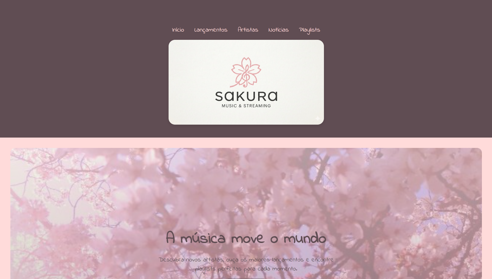

# 🌸 Sakura - Musics

Um projeto de site musical desenvolvido para praticar HTML e CSS, inspirado em plataformas modernas de música com uma estética suave e aconchegante.

---

## ✨ Sobre o projeto

O Sakura - Musics foi criado com o objetivo de praticar:

- Estrutura semântica em HTML
- Flexbox
- Responsividade
- Hover e animações suaves
- Hero sections
- Cards de playlists
- Organização de CSS
- Identidade visual

---

## 🎨 Tecnologias utilizadas

- HTML5
- CSS3
- Google Fonts

---

## 📱 Responsividade

O projeto possui adaptação para dispositivos móveis utilizando:

```css
@media (max-width: 768px)
```

---

## 🚀 Funcionalidades

- Menu de navegação
- Hero section com imagem de fundo
- Botões com hover
- Cards de playlists
- Layout responsivo
- Animações suaves com transition

---

## 📸 Preview



---

## 📚 Aprendizados

Durante o desenvolvimento deste projeto pratiquei:

- Flexbox
- Organização de layouts
- Responsividade
- Estilização moderna com CSS
- Estruturação de componentes visuais

---

## 🔧 Melhorias futuras

- Adicionar modo escuro
- Criar player de música
- Adicionar animações
- Melhorar responsividade
- Integrar JavaScript

---

## 🌸 Autor

Desenvolvido por Luis Vieira.

---

⭐ Projeto desenvolvido para fins de estudo e prática de Frontend.